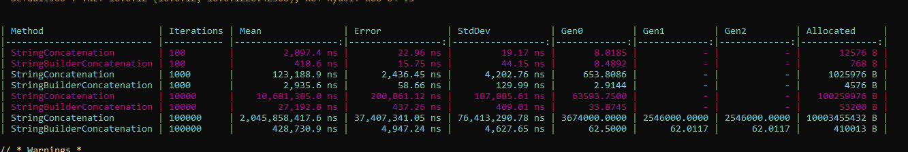

# Benchmark 

### Which approach was faster with 100 iterations?

stringBuilder was faster.

### Which approach was faster with 100,000 iterations?

stringBuilder was faster.

### Which approach allocated more memory?

string concatenation allocated more memory.

### What happened to string concatenation performance as the loop size increased?

string concatenation became much slower as the loop size increased.

### Why does repeated string concatenation create additional allocations?

because strings are immutable each concatenation creates a new string object instead of modifying the existing string.

### Why does StringBuilder usually perform better when text is repeatedly appended?

because StringBuilder is mutable it can modify its internal buffer when text is appended instead of creating a new string object for every append.

### Is StringBuilder always better than normal string operations? Explain.

no stringBuilder is not always better for simple or small string operations normal string concatenation can be simpler , stringBuilder becomes more useful when text is repeatedly appended, especially in loops.

